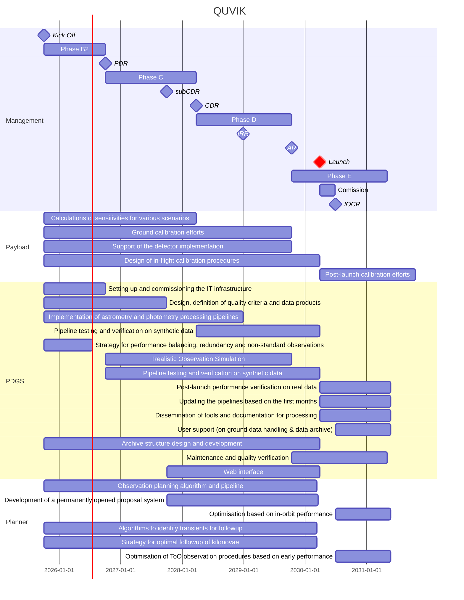

## Deployment

```mermaid
gantt
    title QUVIK
    dateFormat  YYYY-MM-DD
    section Management
    Kick Off : milestone, m1, 2025-09-31, 1d
    Phase B2 : b2, after m1, 52w
    PDR : milestone, pdr, after b2, 1d
    Phase C : c1, after pdr, 77w
    subCDR :  milestone, sc1, after des, 1d
    CDR : milestone, cdr, after c1, 1d
    Phase D : d1, after cdr, 81w
    IRR : milestone, irr, after imp, 1d
    AR : milestone, ar, after d1, 1d
    Launch : crit, milestone, frr, after dcal, 1d
    Phase E : e1, after ar, 81w
    Comission : e2, after frr, 13w
    IOCR : milestone, iocr, after e2, 1d

    section Payload
    Calculations of sensitivities for various scenarios :  after m1 , until cdr
    Ground calibration efforts :  after m1 , until ar
    Support of the detector implementation :  after m1 , until ar 
    Design of in-flight calibration procedures :  dcal, after m1 , 234w
    Post-launch calibration efforts :  after frr , 81w 

    section PDGS
    Setting up and commissioning the IT infrastructure : after m1, until pdr
    Design, definition of quality criteria and data products : 	des, after m1	, 104w
    Implementation of astrometry and photometry processing pipelines : 	imp, after m1 , 169w
    Pipeline testing and verification on synthetic data : pp, after cdr, until frr
    Strategy for performance balancing, redundancy and non-standard observations :  after m1 , until arr
    Realistic Observation Simulation :  after pdr , until ar
    Pipeline testing and verification on synthetic data :  after pdr , until frr
    Post-launch performance verification on real data :  after frr , 420d
    Updating the pipelines based on the first months :  after frr , 420d
    Dissemination of tools and documentation for processing :  after frr , 420d
     User support (on ground data handling & data archive) :  after iocr , 330d
     Archive structure design and development :  after m1 , until frr
     Maintenance and quality verification :  after ar , 81w
     Web interface :  after sc1 , until frr

    section Planner
    Observation planning algorithm and pipeline :  after m1 , 1620d
    Development of a permanently opened proposal system :  after sc1 , 900d
    Optimisation based on in-orbit performance :  after iocr , 330d
    Algorithms to identify transients for followup :  after m1 , 1620d
    Strategy for optimal followup of kilonovae :  after m1 , 1620d
    Optimisation of ToO observation procedures based on early performance :  after iocr , 330d
```
