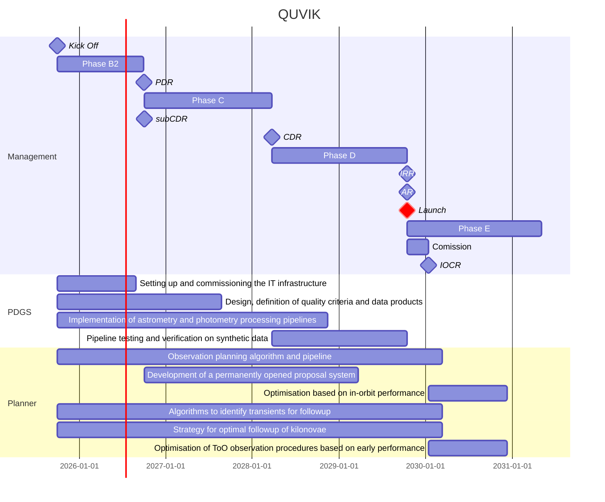

## Deployment

```mermaid
gantt
    title QUVIK
    dateFormat  YYYY-MM-DD
    section Management
    Kick Off : milestone, m1, 2025-09-31, 1d
    Phase B2 : b2, after m1, 52w
    PDR : milestone, pdr, after b2, 1d
    Phase C : c1, after pdr, 77w
    subCDR :  milestone, sc1, after pdr + 52w, 1d
    CDR : milestone, cdr, after c1, 1d
    Phase D : d1, after cdr, 81w
    IRR : milestone, irr, after d1, 1d
    AR : milestone, ar, after d1, 1d
    Launch : crit, milestone, frr, after d1, 1d
    Phase E : e1, after frr, 81w
    Comission : e2, after frr, 13w
    IOCR : milestone, iocr, after e2, 1d
    
    section PDGS
    Setting up and commissioning the IT infrastructure : after m1, 330d
    Design, definition of quality criteria and data products : 	after m1	, 690d
    Implementation of astrometry and photometry processing pipelines : 	after m1 , 1140d
    Pipeline testing and verification on synthetic data : pp, after cdr, until frr

    section Planner
    Observation planning algorithm and pipeline :  after m1 , 1620d
    Development of a permanently opened proposal system :  after sc1 , 900d
    Optimisation based on in-orbit performance :  after iocr , 330d
    Algorithms to identify transients for followup :  after m1 , 1620d
    Strategy for optimal followup of kilonovae :  after m1 , 1620d
    Optimisation of ToO observation procedures based on early performance :  after iocr , 330d
```
