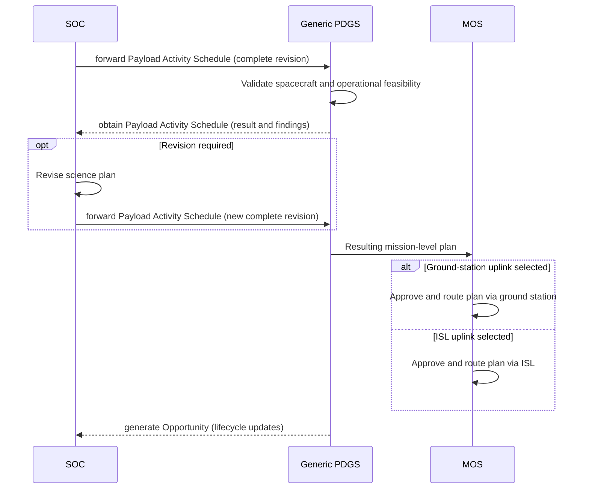
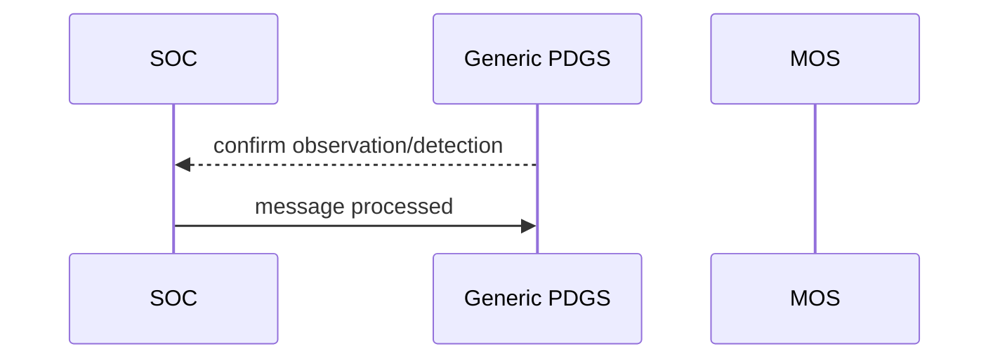

```mermaid
sequenceDiagram
    participant SOC
    participant GPDGS as Generic PDGS
    participant MOS

    SOC->>GPDGS: forward Payload Activity Schedule (complete revision)
    GPDGS->>GPDGS: Validate spacecraft and operational feasibility
    GPDGS-->>SOC: obtain Payload Activity Schedule (result and findings)
    opt Revision required
        SOC->>SOC: Revise science plan
        SOC->>GPDGS: forward Payload Activity Schedule (new complete revision)
    end
    GPDGS->>MOS: Resulting mission-level plan
    alt Ground-station uplink selected
        MOS->>MOS: Approve and route plan via ground station
    else ISL uplink selected
        MOS->>MOS: Approve and route plan via ISL
    end
    GPDGS-->>SOC: generate Opportunity (lifecycle updates)
```

```mermaid
sequenceDiagram
    participant SOC
    participant GPDGS as Generic PDGS
    participant MOS
GPDGS-->>SOC: confirm observation/detection
SOC->>GPDGS: message processed

```
