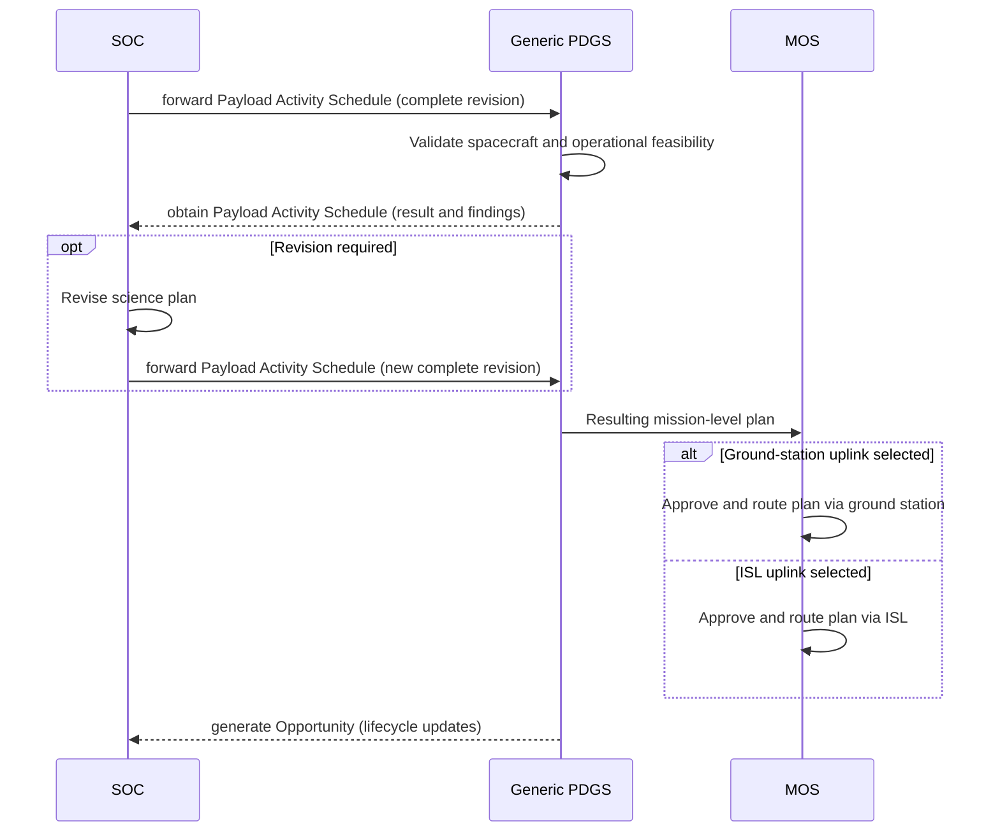
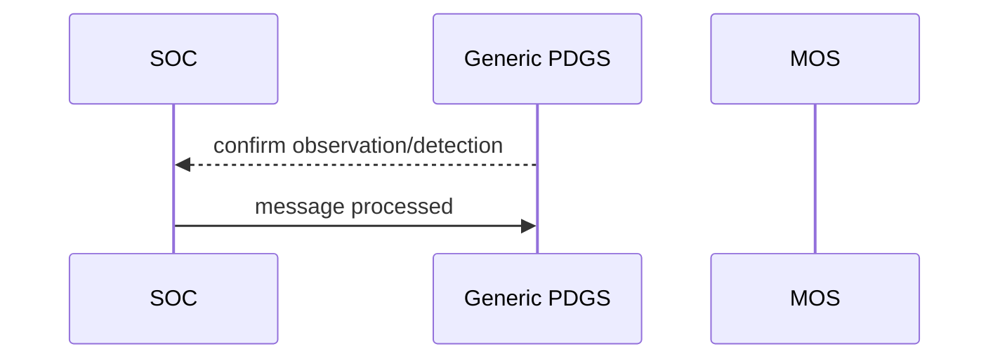
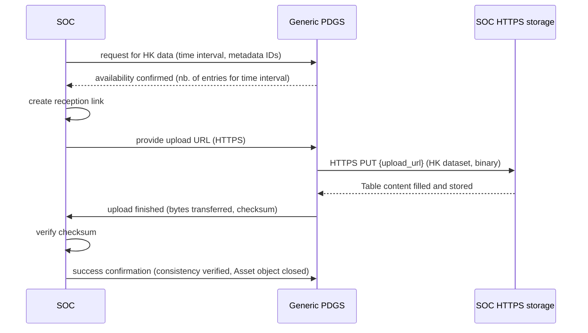
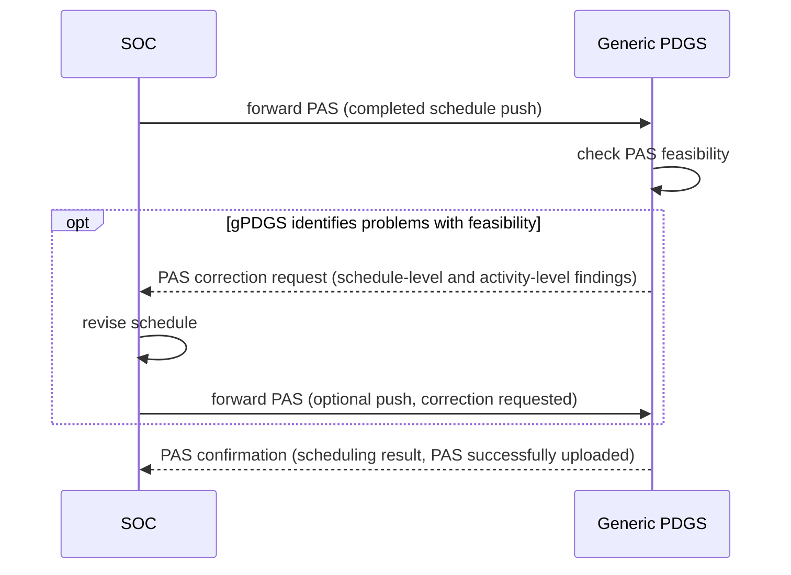

```mermaid
sequenceDiagram
    participant SOC
    participant GPDGS as Generic PDGS
    participant MOS

    SOC->>GPDGS: forward Payload Activity Schedule (complete revision)
    GPDGS->>GPDGS: Validate spacecraft and operational feasibility
    GPDGS-->>SOC: obtain Payload Activity Schedule (result and findings)
    opt Revision required
        SOC->>SOC: Revise science plan
        SOC->>GPDGS: forward Payload Activity Schedule (new complete revision)
    end
    GPDGS->>MOS: Resulting mission-level plan
    alt Ground-station uplink selected
        MOS->>MOS: Approve and route plan via ground station
    else ISL uplink selected
        MOS->>MOS: Approve and route plan via ISL
    end
    GPDGS-->>SOC: generate Opportunity (lifecycle updates)
```
## Table 3 – AMQP scheme for observation confirmation

```mermaid
sequenceDiagram
    participant SOC
    participant GPDGS as Generic PDGS
    participant MOS
GPDGS-->>SOC: confirm observation/detection
SOC->>GPDGS: message processed

```

## Table 4 – AMQP scheme for housekeeping request (IF-2, sect. 3.1.1)

```mermaid
sequenceDiagram
    participant SOC
    participant GPDGS as Generic PDGS
    participant STOR as SOC HTTPS storage

    SOC->>GPDGS: request for HK data (time interval, metadata IDs)
    GPDGS-->>SOC: availability confirmed (nb. of entries for time interval)
    SOC->>SOC: create reception link
    SOC->>GPDGS: provide upload URL (HTTPS)
    GPDGS->>STOR: HTTPS PUT {upload_url} (HK dataset, binary)
    STOR-->>GPDGS: Table content filled and stored
    GPDGS->>SOC: upload finished (bytes transferred, checksum)
    SOC->>SOC: verify checksum
    SOC->>GPDGS: success confirmation (consistency verified, Asset object closed)
```

## Table 5 – SOC schedule submission, PAS (IF-2, sect. 3.1.2)

```mermaid
sequenceDiagram
    participant SOC
    participant GPDGS as Generic PDGS

    SOC->>GPDGS: forward PAS (completed schedule push)
    GPDGS->>GPDGS: check PAS feasibility
    opt gPDGS identifies problems with feasibility
        GPDGS-->>SOC: PAS correction request (schedule-level and activity-level findings)
        SOC->>SOC: revise schedule
        SOC->>GPDGS: forward PAS (optional push, correction requested)
    end
    GPDGS-->>SOC: PAS confirmation (scheduling result, PAS successfully uploaded)
```
