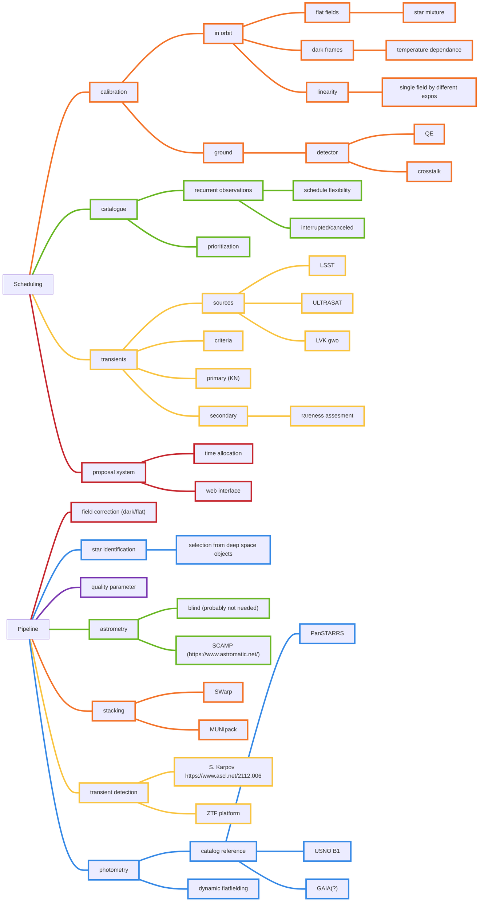

### PDGS Configuration Items

```mermaid
graph LR
  id0["Scheduling"] --- id2["calibration"];  style id2 stroke:#f37329,stroke-width:4px;  linkStyle 0 stroke:#f37329,stroke-width:4px;
  id2["calibration"] --- id3["in orbit"];  style id3 stroke:#f37329,stroke-width:4px;  linkStyle 1 stroke:#f37329,stroke-width:4px;
  id3["in orbit"] --- id4["flat fields"];  style id4 stroke:#f37329,stroke-width:4px;  linkStyle 2 stroke:#f37329,stroke-width:4px;
  id4["flat fields"] --- id5["star mixture"];  style id5 stroke:#f37329,stroke-width:4px;  linkStyle 3 stroke:#f37329,stroke-width:4px;
  id3["in orbit"] --- id10["dark frames"];  style id10 stroke:#f37329,stroke-width:4px;  linkStyle 4 stroke:#f37329,stroke-width:4px;
  id10["dark frames"] --- id11["temperature dependance"];  style id11 stroke:#f37329,stroke-width:4px;  linkStyle 5 stroke:#f37329,stroke-width:4px;
  id3["in orbit"] --- id25["linearity"];  style id25 stroke:#f37329,stroke-width:4px;  linkStyle 6 stroke:#f37329,stroke-width:4px;
  id25["linearity"] --- id26["single field by different expos"];  style id26 stroke:#f37329,stroke-width:4px;  linkStyle 7 stroke:#f37329,stroke-width:4px;
  id2["calibration"] --- id6["ground"];  style id6 stroke:#f37329,stroke-width:4px;  linkStyle 8 stroke:#f37329,stroke-width:4px;
  id6["ground"] --- id12["detector"];  style id12 stroke:#f37329,stroke-width:4px;  linkStyle 9 stroke:#f37329,stroke-width:4px;
  id12["detector"] --- id13["QE"];  style id13 stroke:#f37329,stroke-width:4px;  linkStyle 10 stroke:#f37329,stroke-width:4px;
  id12["detector"] --- id14["crosstalk"];  style id14 stroke:#f37329,stroke-width:4px;  linkStyle 11 stroke:#f37329,stroke-width:4px;
  id0["Scheduling"] --- id21["catalogue"];  style id21 stroke:#68b723,stroke-width:4px;  linkStyle 12 stroke:#68b723,stroke-width:4px;
  id21["catalogue"] --- id22["recurrent observations"];  style id22 stroke:#68b723,stroke-width:4px;  linkStyle 13 stroke:#68b723,stroke-width:4px;
  id22["recurrent observations"] --- id23["schedule flexibility"];  style id23 stroke:#68b723,stroke-width:4px;  linkStyle 14 stroke:#68b723,stroke-width:4px;
  id22["recurrent observations"] --- id24["interrupted/canceled"];  style id24 stroke:#68b723,stroke-width:4px;  linkStyle 15 stroke:#68b723,stroke-width:4px;
  id21["catalogue"] --- id27["prioritization"];  style id27 stroke:#68b723,stroke-width:4px;  linkStyle 16 stroke:#68b723,stroke-width:4px;
  id0["Scheduling"] --- id7["transients"];  style id7 stroke:#f9c440,stroke-width:4px;  linkStyle 17 stroke:#f9c440,stroke-width:4px;
  id7["transients"] --- id8["sources"];  style id8 stroke:#f9c440,stroke-width:4px;  linkStyle 18 stroke:#f9c440,stroke-width:4px;
  id8["sources"] --- id9["LSST"];  style id9 stroke:#f9c440,stroke-width:4px;  linkStyle 19 stroke:#f9c440,stroke-width:4px;
  id8["sources"] --- id42["ULTRASAT"];  style id42 stroke:#f9c440,stroke-width:4px;  linkStyle 20 stroke:#f9c440,stroke-width:4px;
  id8["sources"] --- id43["LVK gwo"];  style id43 stroke:#f9c440,stroke-width:4px;  linkStyle 21 stroke:#f9c440,stroke-width:4px;
  id7["transients"] --- id15["criteria"];  style id15 stroke:#f9c440,stroke-width:4px;  linkStyle 22 stroke:#f9c440,stroke-width:4px;
  id7["transients"] --- id16["primary (KN)"];  style id16 stroke:#f9c440,stroke-width:4px;  linkStyle 23 stroke:#f9c440,stroke-width:4px;
  id7["transients"] --- id17["secondary"];  style id17 stroke:#f9c440,stroke-width:4px;  linkStyle 24 stroke:#f9c440,stroke-width:4px;
  id17["secondary"] --- id18["rareness assesment"];  style id18 stroke:#f9c440,stroke-width:4px;  linkStyle 25 stroke:#f9c440,stroke-width:4px;
  id0["Scheduling"] --- id1["proposal system"];  style id1 stroke:#c6262e,stroke-width:4px;  linkStyle 26 stroke:#c6262e,stroke-width:4px;
  id1["proposal system"] --- id19["time allocation"];  style id19 stroke:#c6262e,stroke-width:4px;  linkStyle 27 stroke:#c6262e,stroke-width:4px;
  id1["proposal system"] --- id20["web interface"];  style id20 stroke:#c6262e,stroke-width:4px;  linkStyle 28 stroke:#c6262e,stroke-width:4px;
  id28["Pipeline"] --- id32["field correction (dark/flat)"];  style id32 stroke:#c6262e,stroke-width:4px;  linkStyle 29 stroke:#c6262e,stroke-width:4px;
  id28["Pipeline"] --- id29["star identification"];  style id29 stroke:#3689e6,stroke-width:4px;  linkStyle 30 stroke:#3689e6,stroke-width:4px;
  id29["star identification"] --- id49["selection from deep space objects"];  style id49 stroke:#3689e6,stroke-width:4px;  linkStyle 31 stroke:#3689e6,stroke-width:4px;
  id28["Pipeline"] --- id30["quality parameter"];  style id30 stroke:#7a36b1,stroke-width:4px;  linkStyle 32 stroke:#7a36b1,stroke-width:4px;
  id28["Pipeline"] --- id37["astrometry"];  style id37 stroke:#68b723,stroke-width:4px;  linkStyle 33 stroke:#68b723,stroke-width:4px;
  id37["astrometry"] --- id38["blind (probably not needed)"];  style id38 stroke:#68b723,stroke-width:4px;  linkStyle 34 stroke:#68b723,stroke-width:4px;
  id37["astrometry"] --- id39["SCAMP (https://www.astromatic.net/)"];  style id39 stroke:#68b723,stroke-width:4px;  linkStyle 35 stroke:#68b723,stroke-width:4px;
  id28["Pipeline"] --- id33["stacking"];  style id33 stroke:#f37329,stroke-width:4px;  linkStyle 36 stroke:#f37329,stroke-width:4px;
  id33["stacking"] --- id40["SWarp"];  style id40 stroke:#f37329,stroke-width:4px;  linkStyle 37 stroke:#f37329,stroke-width:4px;
  id33["stacking"] --- id41["MUNIpack"];  style id41 stroke:#f37329,stroke-width:4px;  linkStyle 38 stroke:#f37329,stroke-width:4px;
  id28["Pipeline"] --- id34["transient detection"];  style id34 stroke:#f9c440,stroke-width:4px;  linkStyle 39 stroke:#f9c440,stroke-width:4px;
  id34["transient detection"] --- id35["S. Karpov  https://www.ascl.net/2112.006"];  style id35 stroke:#f9c440,stroke-width:4px;  linkStyle 40 stroke:#f9c440,stroke-width:4px;
  id34["transient detection"] --- id36["ZTF platform"];  style id36 stroke:#f9c440,stroke-width:4px;  linkStyle 41 stroke:#f9c440,stroke-width:4px;
  id28["Pipeline"] --- id44["photometry"];  style id44 stroke:#3689e6,stroke-width:4px;  linkStyle 42 stroke:#3689e6,stroke-width:4px;
  id44["photometry"] --- id45["catalog reference"];  style id45 stroke:#3689e6,stroke-width:4px;  linkStyle 43 stroke:#3689e6,stroke-width:4px;
  id45["catalog reference"] --- id46["PanSTARRS"];  style id46 stroke:#3689e6,stroke-width:4px;  linkStyle 44 stroke:#3689e6,stroke-width:4px;
  id45["catalog reference"] --- id47["USNO B1"];  style id47 stroke:#3689e6,stroke-width:4px;  linkStyle 45 stroke:#3689e6,stroke-width:4px;
  id45["catalog reference"] --- id48["GAIA(?)"];  style id48 stroke:#3689e6,stroke-width:4px;  linkStyle 46 stroke:#3689e6,stroke-width:4px;
  id44["photometry"] --- id50["dynamic flatfielding"];  style id50 stroke:#3689e6,stroke-width:4px;  linkStyle 47 stroke:#3689e6,stroke-width:4px;

```
