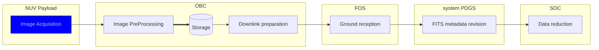

```mermaid
flowchart LR
  subgraph s1[NUV Payload]
    ia[Image Acquisition]
  end
  subgraph s2[OBC]
    ip[Image PreProcessing] ==> st[(Storage)] --> dl[Downlink preparation]
  end
  subgraph s3[FOS]
    gr[Ground reception]
  end
  subgraph s4[system PDGS]
    fits[FITS metadata revision]
  end
  subgraph s5[SOC]
    pr[Data reduction]
  end

  ia --> ip
  dl --> gr --> fits --> pr

  classDef deC fill:#00f,stroke:#000,color:#bbb;
  class ia deC;


```
