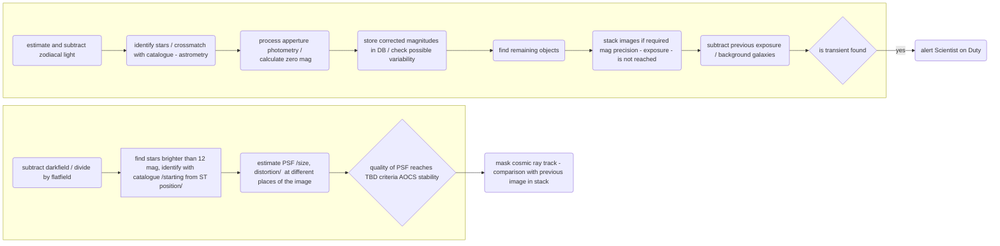
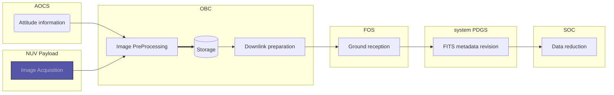

```mermaid
flowchart LR
    df(subtract darkfield / divide by flatfield)
	ql{quality of PSF reaches TBD criteria AOCS stability} --> crm(mask cosmic ray track - comparison with previous image in stack)
    fs[find stars brighter than 12 mag, identify with catalogue /starting from ST position/]
	ws(estimate PSF /size, distortion/  at different places of the image)
	zl(estimate and subtract zodiacal light)
	am(identify stars / crossmatch with catalogue - astrometry)
	pm(process apperture photometry /<br/> calculate zero mag)
	st(store corrected magnitudes in DB / check possible variability)
	fo(find remaining objects)
	si(stack images if required mag precision - exposure - is not reached)
	bg(subtract previous exposure / background galaxies)
	tf{is transient found} --yes--> SD(alert Scientist on Duty)
	
	subgraph Z[" "]
    direction LR
	df --> fs --> ws -->  ql
    end
    subgraph W[" "]
    direction LR
	zl --> am --> pm --> st --> fo --> si --> bg --> tf
    end
```

```mermaid
flowchart LR
  classDef deC fill:#55a,stroke:#000,color:#bbb;
  subgraph s1[NUV Payload]
    ia[Image Acquisition]:::deC
  end
  subgraph s2[OBC]
    ip[Image PreProcessing] ==> st[(Storage)] --> dl[Downlink preparation]
  end
  subgraph s3[FOS]
    gr[Ground reception]
  end
  subgraph s4[system PDGS]
    fits[FITS metadata revision]
  end
  subgraph s5[SOC]
    pr[Data reduction]
  end
  subgraph s0[AOCS]
    ai(Attitude information) --> ip
  end

  ia --> ip
  dl --> gr --> fits --> pr

  class ia deC;


```
