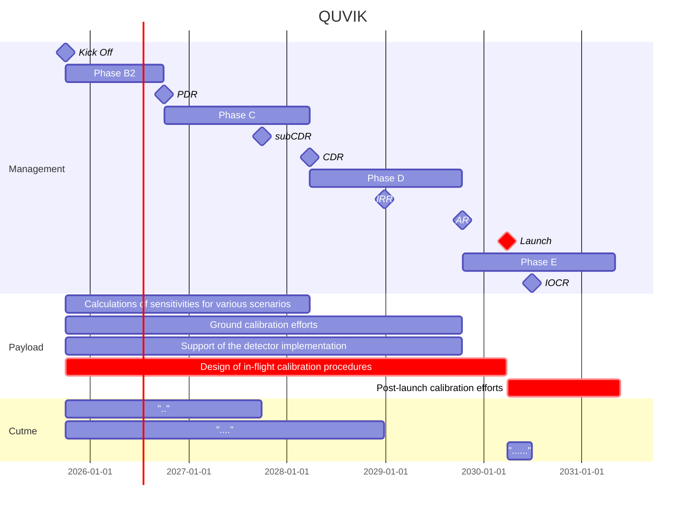

.mermaid .dcal {
    	fill: white !important;
    	stroke: blue !important;
    	stroke-width: 1.2 !important;
    	opacity: 0.7 !important;
    }

```mermaid
gantt
    title QUVIK
    dateFormat  YYYY-MM-DD
    section Management
    Kick Off : milestone, m1, 2025-09-31, 1d
    Phase B2 : b2, after m1, 52w
    PDR : milestone, pdr, after b2, 1d
    Phase C : c1, after pdr, 77w
    subCDR :  milestone, sc1, after des, 1d
    CDR : milestone, cdr, after c1, 1d
    Phase D : d1, after cdr, 81w
    IRR : milestone, irr, after imp, 1d
    AR : milestone, ar, after d1, 1d
    Launch : crit, milestone, frr, after dcal, 1d
    Phase E : e1, after ar, 81w
    IOCR : milestone, iocr, after e2, 1d

    section Payload
    Calculations of sensitivities for various scenarios :  after m1 , until cdr
    Ground calibration efforts :  after m1 , until ar
    Support of the detector implementation :  after m1 , until ar 
    Design of in-flight calibration procedures : crit, dcal, after m1 , 234w
    Post-launch calibration efforts : crit, after frr , 420d

    section Cutme 
    ".." : 	des, after m1	, 104w
    "...." : imp, after m1 , 169w
    "......" : e2, after frr, 13w

```
