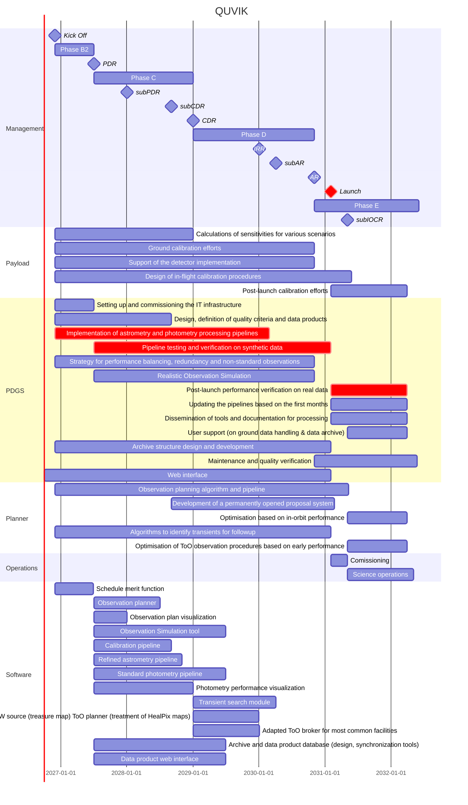

```mermaid
gantt
    title QUVIK
    dateFormat  YYYY-MM-DD
    section Management
    Kick Off : milestone, m1, 2026-12-01, 1d
    Phase B2 : b2, after m1, 213d
    PDR : milestone, pdr, after b2, 1d
    Phase C : c1, after pdr, 547d
    subPDR :  milestone, sp1, after SD-3, 1d
    subCDR :  milestone, sc1, after SD-5, 1d
    CDR : milestone, cdr, after c1, 1d
    Phase D : d1, after cdr, 668d
    IRR : milestone, irr, after SD-11, 1d
    subAR: milestone, sar, after SD-9, 1d
    AR : milestone, ar, after d1, 1d
    Launch : crit, milestone, frr, after fol, 1d
    Phase E : e1, after ar, 578d
    subIOCR : milestone, iocr, after e2, 1d

    section Payload
    Calculations of sensitivities for various scenarios :  after m1 , until cdr
    Ground calibration efforts :  after m1 , until ar
    Support of the detector implementation :  after m1 , until ar 
    Design of in-flight calibration procedures :  dcal, after m1 , 234w
    Post-launch calibration efforts : after frr , 420d

    section PDGS
    Setting up and commissioning the IT infrastructure : after m1, until pdr
    Design, definition of quality criteria and data products : 	des, after m1	, until sc1
    Implementation of astrometry and photometry processing pipelines :crit, imp, after m1 , 169w
    Pipeline testing and verification on synthetic data :crit,  pp, after pdr, until frr
    Strategy for performance balancing, redundancy and non-standard observations :  after m1 , until ar
    Realistic Observation Simulation :  after pdr , until ar
    Post-launch performance verification on real data :crit,   after frr , 420d
    Updating the pipelines based on the first months :  after frr , 420d
    Dissemination of tools and documentation for processing :  after frr , 420d
     User support (on ground data handling & data archive) :  after iocr , 330d
     Archive structure design and development :  after m1 , until frr
     Maintenance and quality verification :  after ar , 81w
     Web interface :  after ko , until frr

    section Planner
    Observation planning algorithm and pipeline :  after m1 , 1620d
    Development of a permanently opened proposal system : after sc1 , 900d
    Optimisation based on in-orbit performance :  after iocr , 330d
    Algorithms to identify transients for followup : fol, after m1 , 1522d
    Optimisation of ToO observation procedures based on early performance :  after iocr , 330d

    section Operations
    Comissioning : e2, after frr, 13w
    Science operations : e3, after iocr, 52w

    section Software
        Schedule merit function: SD-2, after m1, 212d
        Observation planner: SD-2, after pdr, 364d
        Observation plan visualization: SD-3, after pdr, 182d
        Observation Simulation tool: SD-4, after pdr, 729d
        Calibration pipeline: SD-5, after pdr, 427d
        Refined astrometry pipeline: SD-6, after pdr, 486d
        Standard photometry pipeline: SD-7, after pdr, 729d
        Photometry performance visualization: SD-8, after pdr, 547d
        Transient search module: SD-9, after cdr, 457d
        GW source (treasure map) ToO planner (treatment of HealPix maps): SD-10, after cdr, 364d
        Adapted ToO broker for most common facilities: SD-11, after cdr, 366d
        Archive and data product database (design, synchronization tools): SD-12, after pdr, 729d
        Data product web interface: SD-13, after pdr, 729d
```
