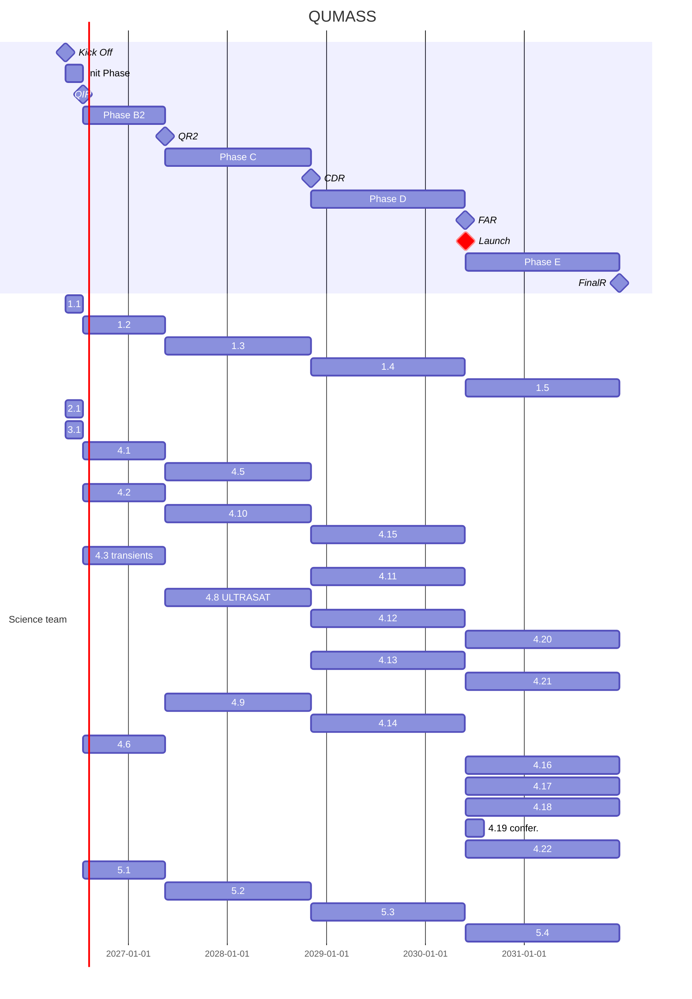

```mermaid
gantt
    title QUMASS
    dateFormat  YYYY-MM-DD
    Kick Off : milestone, ko, 2026-05-14, 1d
    Init Phase : b1, after ko, 9w
    QIR : milestone, ir, after b1, 1d
    Phase B2 : b2, after ir, 43w
    QR2 : milestone, pdr, after b2, 1d
    Phase C : c1, after pdr, 77w
    CDR : milestone, cdr, after c1, 1d
    Phase D : d1, after cdr, 81w
    FAR : milestone, far, after d1, 1d
    Launch : crit, milestone, frr, after far, 1d
    Phase E : e1, after far, 81w
    FinalR : milestone, fr, after e1, 1d

    section Science team
    1.1 : after ko, until ir
    1.2 : after ir, until pdr
    1.3 : after pdr, until cdr
    1.4 : after cdr, until far
    1.5 : after far, until fr
    2.1 : after ko, until ir
    3.1 : after ko, until ir
    4.1 : after ir, until pdr
    4.5 : after pdr, until cdr
    4.2 : after ir, until pdr
    4.10 : after pdr, until cdr
    4.15 : after cdr, until far
    4.3 transients : after ir, until pdr
    4.11 : after cdr, until far
    4.8 ULTRASAT : after pdr, until cdr
    4.12 : after cdr, until far
    4.20 : after far, until fr
    4.13 : after cdr, until far
    4.21 : after far, until fr
    4.9 : after pdr, until cdr
    4.14 : after cdr, until far
    4.6 : after ir, until pdr
    4.16 : after far, until fr
    4.17 : after far, until fr
    4.18 : after far, until fr
    4.19 confer. : after far, 10w
    4.22 : after far, until fr
    5.1 : after ir, until pdr
    5.2 : after pdr, until cdr
    5.3 : after cdr, until far
    5.4 : after far, until fr

```
