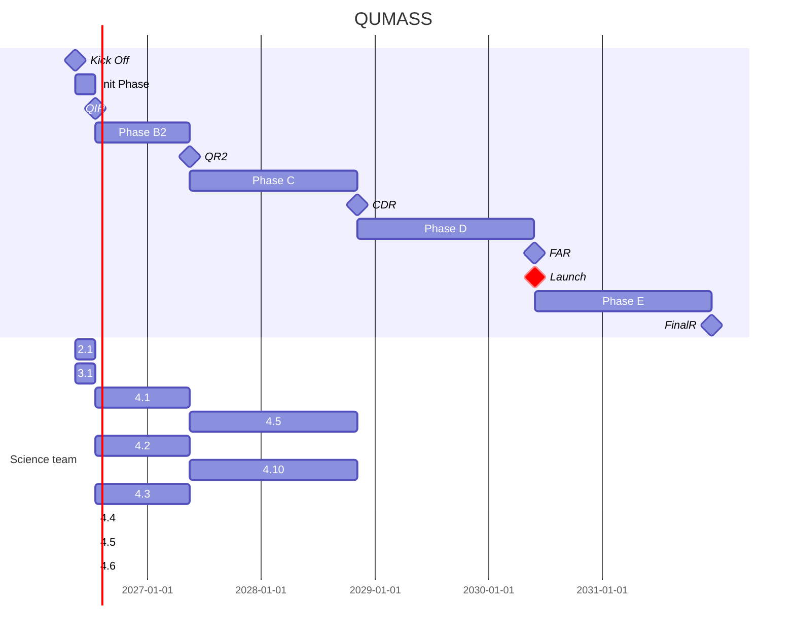

```mermaid
gantt
    title QUMASS
    dateFormat  YYYY-MM-DD
    Kick Off : milestone, ko, 2026-05-14, 1d
    Init Phase : b1, after ko, 9w
    QIR : milestone, ir, after b1, 1d
    Phase B2 : b2, after ir, 43w
    QR2 : milestone, pdr, after b2, 1d
    Phase C : c1, after pdr, 77w
    CDR : milestone, cdr, after c1, 1d
    Phase D : d1, after cdr, 81w
    FAR : milestone, far, after d1, 1d
    Launch : crit, milestone, frr, after far, 1d
    Phase E : e1, after far, 81w
    FinalR : milestone, fr, after e1, 1d

    section Science team
    2.1 : after ko, until ir
    3.1 : after ko, until ir
    4.1 : after ir, until pdr
    4.5 : after pdr, until cdr
    4.2 : after ir, until pdr
    4.10 : after pdr, until cdr
    4.3 : after ir, until pdr
    4.4 : after ir, 5m
    4.5 : after ir, 5m
    4.6 : after ir, 6m
```
