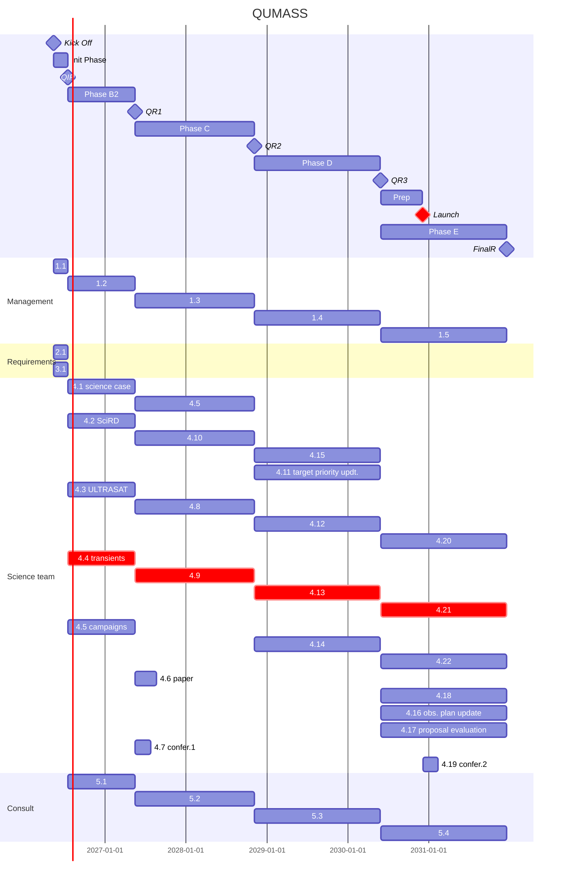

```mermaid
gantt
    title QUMASS
    dateFormat  YYYY-MM-DD
    Kick Off : milestone, ko, 2026-05-14, 1d
    Init Phase : b1, after ko, 9w
    QIR : milestone, ir, after b1, 1d
    Phase B2 : b2, after ir, 43w
    QR1 : milestone, pdr, after b2, 1d
    Phase C : c1, after pdr, 77w
    QR2 : milestone, cdr, after c1, 1d
    Phase D : d1, after cdr, 81w
    QR3 : milestone, far, after d1, 1d
    Prep : prep, after far, 27w
    Launch : crit, milestone, frr, after prep, 1d
    Phase E : e1, after far, 81w
    FinalR : milestone, fr, after e1, 1d

    section Management
    1.1 : after ko, until ir
    1.2 : after ir, until pdr
    1.3 : after pdr, until cdr
    1.4 : after cdr, until far
    1.5 : after far, until fr
    section Requirements
    2.1 : after ko, until ir
    3.1 : after ko, until ir
    section Science team
    4.1 science case : after ir, until pdr
    4.5 : after pdr, until cdr
    4.2 SciRD : after ir, until pdr
    4.10 : after pdr, until cdr
    4.15 : after cdr, until far
    4.11 target priority updt. : after cdr, until far
    4.3 ULTRASAT : after ir, until pdr
    4.8 : after pdr, until cdr
    4.12 : after cdr, until far
    4.20 : after far, until fr
    4.4 transients : crit, after ir, until pdr
    4.9 : crit, after pdr, until cdr
    4.13 : crit, after cdr, until far
    4.21 : crit, after far, until fr
    4.5 campaigns : after ir, until pdr
    4.14 : after cdr, until far
    4.22 : after far, until fr
    4.6 paper : after pdr, 14w
    4.18 : after far, until fr
    4.16 obs. plan update : after far, until fr
    4.17 proposal evaluation : after far, until fr
    4.7 confer.1 : after pdr, 10w
    4.19 confer.2 : after frr, 10w
    section Consult
    5.1 : after ir, until pdr
    5.2 : after pdr, until cdr
    5.3 : after cdr, until far
    5.4 : after far, until fr

```
