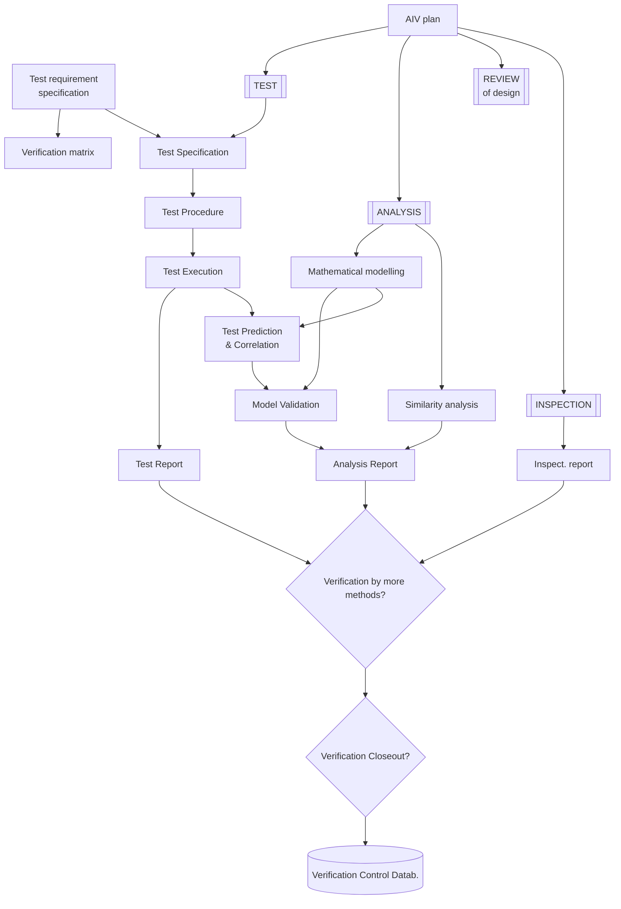

Validation Report

```mermaid
flowchart TB
  TRS["`Test requirement
  specification`"]
  VM["Verification matrix"]
  VCD[(Verification Control Datab.)]

  AIV["AIV plan"]
  TEST[["TEST"]]
  TS["Test Specification"]
  TP["Test Procedure"]
  TE["Test Execution"]
  TPC["`Test Prediction
& Correlation`"]
  TR["Test Report"]

  INS[["INSPECTION"]]
  IR["Inspect. report"]
  ANAL[["ANALYSIS"]]
  MM["Mathematical modelling"]
  MV["Model Validation"]
  SM["Similarity analysis"]
  AR["Analysis Report"]

  ROD[["`REVIEW
  of design`"]]

  meth{"Verification by more methods?"}
  close{"Verification Closeout?"}
  
  TEST --> TS --> TP --> TE --> TR --> meth
  TRS --> VM
  TRS --> TS
  AIV --> TEST
  AIV --> ANAL
  ANAL --> MM --> MV --> AR
  ANAL --> SM --> AR --> meth
  AIV --> ROD
  AIV --> INS --> IR --> meth
  MM --> TPC
  TE --> TPC --> MV 
  meth --> close --> VCD

```
