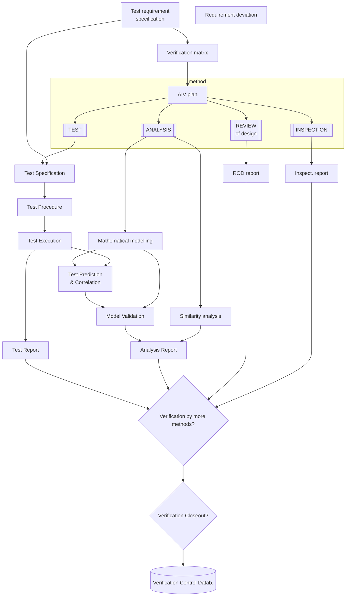

Validation Report

```mermaid
flowchart TD

  TRS["`Test requirement
  specification`"]
  VM["Verification matrix"]
  VCD[(Verification Control Datab.)]

  AIV["AIV plan"]

    TEST[["TEST"]]
    INS[["INSPECTION"]]
    ANAL[["ANALYSIS"]]
    ROD[["`REVIEW
    of design`"]]

  TS["Test Specification"]
  TP["Test Procedure"]
  TE["Test Execution"]
  TPC["`Test Prediction
& Correlation`"]
  TR["Test Report"]

  IR["Inspect. report"]
  MM["Mathematical modelling"]
  MV["Model Validation"]
  SM["Similarity analysis"]
  AR["Analysis Report"]

  RR["ROD report"]

  RD["Requirement deviation"]

  meth{"Verification by more methods?"}
  close{"Verification Closeout?"}

subgraph method
  AIV --> TEST
  AIV --> ANAL
  AIV --> ROD
  AIV --> INS
end
  TEST --> TS --> TP --> TE --> TR --> meth
  TRS --> VM --> AIV
  TRS --> TS
  
  ANAL --> MM --> TPC --> MV --> AR
  ANAL --> SM --> AR --> meth
  ROD --> RR --> meth
  INS --> IR --> meth
  MM --> MV
  TE --> TPC
  meth --> close --> VCD

```
