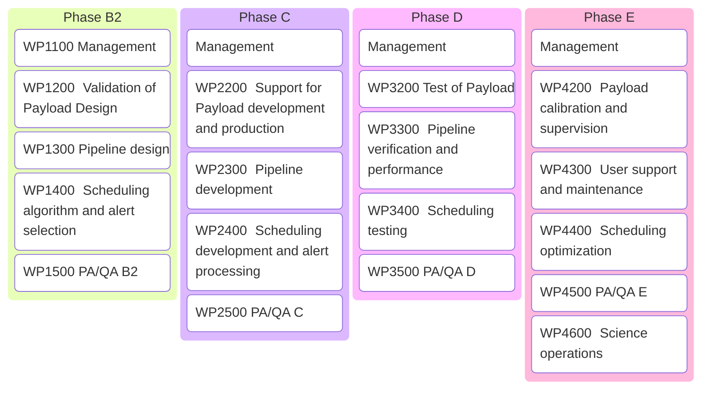

## Software development

### Planner

```mermaid
---
config:
  kanban:
    ticketBaseUrl: 'https://quvik.cz/browse/#TICKET#'
---
kanban
  Phase B2
    [WP1100 Management]
    WP1200	Validation of Payload Design
    WP1300	Pipeline design
    WP1400	Scheduling algorithm and alert selection
    WP1500	PA/QA B2
  [Phase C]
    WP2100[Management]
    WP2200	Support for Payload development and production
    WP2300	Pipeline development
    WP2400	Scheduling development and alert processing
    WP2500	PA/QA C
  id9[Phase D]
    WP3100[Management]
    WP3200	Test of Payload
    WP3300	Pipeline verification and performance
    WP3400	Scheduling testing
    WP3500	PA/QA D
  id10[Phase E]
    WP4100[Management]
    WP4200	Payload calibration and supervision
    WP4300	User support and maintenance
    WP4400	Scheduling optimization
    WP4500	PA/QA E
    WP4600	Science operations
```
