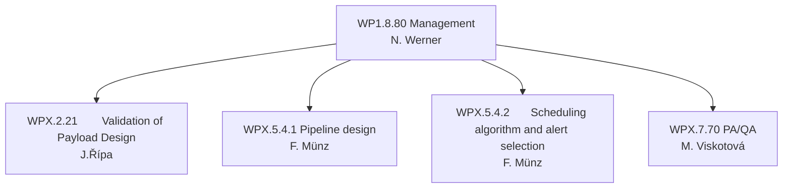
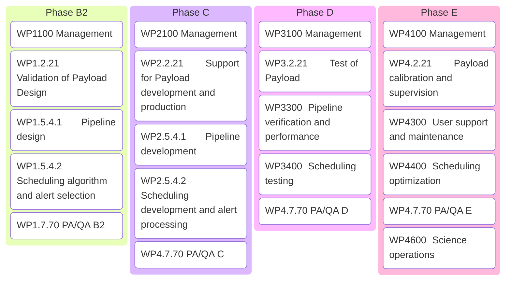

## Software development

### Planner

```mermaid
flowchart TD
a[WP1.8.80 Management
N. Werner] --> b[WPX.2.21	Validation of Payload Design
J.Řípa]
a --> c[WPX.5.4.1 	Pipeline design
F. Münz]
a --> d[WPX.5.4.2	Scheduling algorithm and alert selection
F. Münz]
a-->e[WPX.7.70	PA/QA
M. Viskotová]

```

```mermaid
---
config:
  kanban:
    ticketBaseUrl: 'https://quvik.cz/browse/#TICKET#'
---
kanban
  Phase B2
    [WP1100 Management]
    WP1.2.21	Validation of Payload Design
    WP1.5.4.1	Pipeline design
    WP1.5.4.2	Scheduling algorithm and alert selection
    WP1.7.70	PA/QA B2
  [Phase C]
    [WP2100 Management]
    WP2.2.21	Support for Payload development and production
    WP2.5.4.1	Pipeline development@{ticket:pip_dev}
    WP2.5.4.2	Scheduling development and alert processing
    WP4.7.70	PA/QA C
  id9[Phase D]
    [WP3100 Management]
    WP3.2.21	Test of Payload
    WP3300	Pipeline verification and performance
    WP3400	Scheduling testing
    WP4.7.70	PA/QA D
  id10[Phase E]
    [WP4100 Management]
    WP4.2.21	Payload calibration and supervision
    WP4300	User support and maintenance
    WP4400	Scheduling optimization
    WP4.7.70	PA/QA E
    WP4600	Science operations
```
